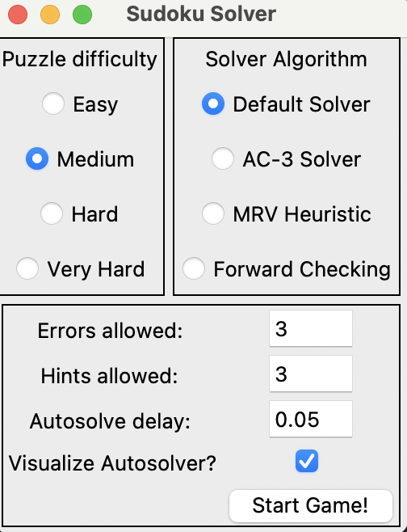

# Sudoku-Solver

## Background

Sudoku is one of the most well known Constraint Satisfaction Problems [CSPs](https://en.wikipedia.org/wiki/Constraint_satisfaction_problem#:~:text=Constraint%20satisfaction%20problems%20(CSPs)%20are,solved%20by%20constraint%20satisfaction%20methods.). I have always had an interest in CSPs and their solutions, so I decided to implement a tool which enables the visualization of several different CSP solution algorithms on Sudoku puzzles of varying difficulties (Note, by difficulty I mean the number of cells that are filled in at the start. This does not necessarily translate to difficulty as a human player, but it does increase the search space of potential solutions).

## Usage

To execute this program, simply run the main.sh script, or run the main.py file in the src folder.
Executing the main python file using:

```bash
python3 src/main.py
```

or running the main script

```bash
main.sh
```

You should then be faced with 

### Errors, Hints, and Autosolver visualization

The options at the bottom of this menu control the number of hints that a human player is allowed to use, the number of errors that a human player is allowed to make, and whether or not the autosolver should animate as it runs, or solve first, and then draw the results at the end. If the autosolver is animating as it runs, the autosolve delay option controls the time (in seconds) between each "guess" that the autosolver makes. For difficult puzzles, this should be left as a low number, while for easy puzzles this can be left higher.

### Difficulty Settings

The difficult settings are fed into the puzzle generation algorithm. They determine the number of values from the solution will be filled in in the final puzzle. Higher difficulty settings will take the generation algorithm longer to compute, since it takes a moment to build a unique solution. The exact algorithm for generation is outlined in the [Auto Generation Algorithm](#auto-generation-algorithm) section.
The difficult settings are as follows:

* Easy: 55 filled cells
* Medium: 45 filled cells
* Hard: 35 filled cells
* Very Hard: 30 filled cells
* Extreme: 22 filled cells

### Solver Types

There are 4 solver types available on the main menu:

1. Default Solver
2. AC-3 Solver
3. MRV Solver
4. Forward Checking Solver

The specifics of these algorithms are outlined in the [Solver Algorithms](#solver-algorithms) section, but for usage all you need to know is that they get faster as you go down the list. With the default solver being the slowest, and Forward Checking being the fastest.

## Auto Generation Algorithm

The auto generation algorithm works in three sections. We begin with a template board, which is a solved board of any kind.

```(python3)
template = Solved Sudoku Board

shuffled = shuffle(template)

board, solution = mask(shuffled)
```

```(python3)
shuffle(board):
 - randomly swap numbers
 - randomly swap rows
 - randomly swap cols
 - randomly swap 3x9 rows
 - randomly swapp 9x3 cols
```

```(python3)
mask(board):
- randomly select n values (row,col) to keep
- pass the board with only these values into an efficient solver
- if the solver finds exactly one solution, return the set of values to keep, and the solution
- else: repeat from random selection
```

## Solver Algorithms

There are 4 solver algorithms currently implemented in this project. Namely,

* Backtracking
* AC-3
* MRV Backtracking
* Forward Checking

Each of these algorithms builds on the previous, so we'll cover them in order.

### Backtracking

[Backtracking](https://en.wikipedia.org/wiki/Backtracking) is essentially a depth-first search through the "solution space" of the problem. That's a fancy way of saying, we try every possible value in every possible cell, and eventually, by brute-force, we find the solution. This is an extremely inefficient method, but can work for smaller problems. Some optimizations can also be made, such as pruning, which cuts off branches from the possible results. For example, if we know that the top left value in the sudoku puzzle cannot be a 1, we don't need to search through all of the possible branches in which the top left value is a 1.

This observation can bring us to AC-3:

### AC-3

[AC-3](https://en.wikipedia.org/wiki/AC-3_algorithm), or Arc-Consistency Algorithm #3 is an algorithm that limits the "domains" of variables at the start of the search. Put more simply, the algorithm looks at all of the values that are affected by a given cell, and removes "impossible" values. For example, look at this board:
 In the top row, as a human we can see that there is only one possible value in the center cell (that being 7). With naive backtracking, we would actually try each value from 1-7 until we finally find the correct value. What AC-3 does, is for each open cell, it limits the values that we can try to *only* the values which are consistent with the board at the start. This drastically reduces the number of dead end searches that we end up making, which causes a significant speedup in search times. In fact, on many easy puzzles AC-3 is sufficient to solve the puzzle without *any* backtracking being required. For a more difficult puzzle, however, the output of AC-3 is passed into a backtracking algorithm to fill in any other possible answers.

This brings us to the next solver type, which is MRV backtracking.

### MRV Backtracking

MRV, or Minimum Remaining Values-backtracking, builds upon AC-3 and regular backtracking. The only change is the order in which we consider values to fill in.

Regular backtracking will usually fill the board from top-left to bottom right, going across the columns. All MRV backtracking does, is proocess cells in order of the number of possible values remaining. This effectively allows us to fill in many of the values in the board instantly, after AC-3 completes, and in general it loads the "difficult" parts of the problem at the end of the search, where less "unwinding" is required to make modifications.

The final optimization is to update the domains of variables *while we're still searching* which is precisely what forward checking does!

### Forward Checking

[Forward Checking](https://en.wikipedia.org/wiki/Look-ahead_(backtracking)) is a way of constraining *future* values based on a decision we're making about the *current* value while backtracking. This enables us to figure out if a value is invalid extremely quickly, since we can look-ahead into what making this decision will do to the rest of the board. As an aside, forward checking is basically how humans actually do sudoku puzzles! We consider what the effects of filling in a cell are on the cells that are "adjacent" to that cell.
